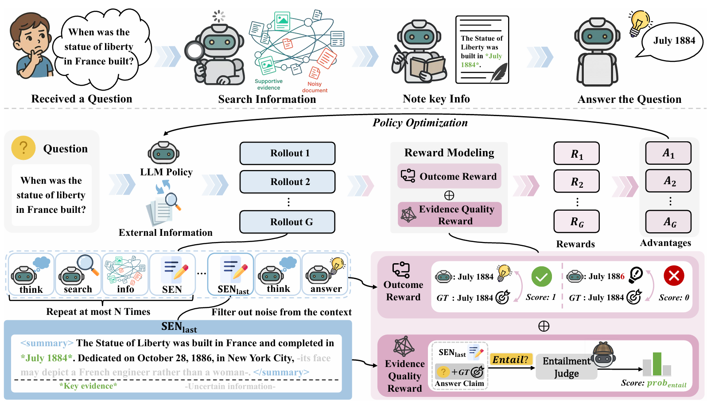
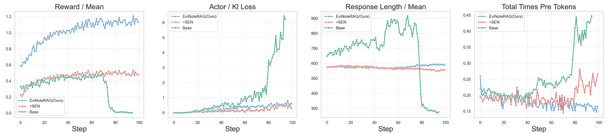

<h1 align="center">
  
  EviNote-RAG: Enhancing RAG Models via Answer-Supportive Evidence Notes
</h1>

<div align="center">

<p><em>EviNote-RAG is a note-taking approach that improves how retrieved information is used in question answering.</em></p>

[](https://huggingface.co/dayll/EviNoteRAG-7B)
[](https://github.com/Da1yuqin/EviNoteRAG)
[](https://arxiv.org/abs/2509.00877)
[](https://huggingface.co/datasets/dayll/EviNoteRAG_nq_hotpotqa_train_and_test_data)
</div>



We proposes EviNote-RAG, a new framework to enhance Retrieval-Augmented Generation (RAG) for open-domain question answering with large language models. Existing RAG methods often suffer from noisy and irrelevant retrieved content, which hampers answer quality and reasoning reliability. EviNote-RAG introduces an intermediate note-taking step: after retrieval, the model generates Supportive-Evidence Notes (SENs) that distill only the answer-critical evidence and explicitly state when no relevant information is found. These notes also annotate key and uncertain facts, mimicking human note-taking to improve focus and robustness. To guide this process, the framework incorporates an Evidence Quality Reward (EQR) based on entailment, assessing whether SENs logically support the final answer. EviNote-RAG is validated on seven QA benchmarks, achieving state-of-the-art results and demonstrating superior generalization and stability compared to strong baselines across both in-domain and out-of-domain tasks. Our findings show that evidence-based abstraction significantly improves both answer accuracy and training robustness for RAG systems.

## 🔥News

[**2025-09-03**] — We’ve open-sourced our full research stack!  
- 📄 **Paper (arXiv)**: [arXiv:2509.00877](https://arxiv.org/abs/2509.00877)
- 💻 **Training/Inference/Evaluation Code (GitHub)**: [EviNoteRAG](https://github.com/Da1yuqin/EviNoteRAG)
- 🤗 **Model on Hugging Face**: [dayll/EviNoteRAG-7B](https://huggingface.co/dayll/EviNoteRAG-7B)
- 📚 **Dataset on Hugging Face Datasets**: [dayll/EviNoteRAG_nq_hotpotqa_train_and_test_data](https://huggingface.co/datasets/dayll/EviNoteRAG_nq_hotpotqa_train_and_test_data)

**What’s included**
- End-to-end training, inference, and evaluation pipelines
- Reproducible configs and scripts
- Pretrained checkpoints and evaluation recipes
- Clear licensing and citation info


## 📋 Table of Contents

- [Features](#-features)
- [Model](#-model)
- [Performance](#-performance)
- [Installation](#-installation)
- [Quick Start](#-quick-start)
- [Evaluation](#-evaluation)
- [Use Your Own Dataset](#-use-your-own-dataset)
- [Use Your Own Search Engine](#-use-your-own-search-engine)
- [Acknowledge](#-acknowledge)
- [Citation](#-citation)

## ⚙️ Features
- Support local sparse retrievers (e.g., BM25). ✔️
- Support local dense retrievers (both flat indexing and ANN indexing) ✔️
- Support google search / bing search / brave search API and others. ✔️
- Support off-the-shelf neural rerankers. ✔️
- Support different RL methods (e.g., PPO, GRPO, reinforce). ✔️
- Support different LLMs (e.g., llama3, Qwen2.5, etc). ✔️


## 🤖 Model
EviNoteRAG is now available on huggingface-hub:
| Model Name | HF Checkpoint                                                | Size                                                    |
| ---------- | ------------------------------------------------------------ | :------: |
| EviNoteRAG-7b     | [🤗 dayll/EviNoteRAG-7B](https://huggingface.co/dayll/EviNoteRAG-7B) | **7B** 


## 🏆 Performance

Our method exhibits clear advantages in training stability and efficiency. While the baseline model Search-R1 suffers from optimization collapse—evidenced by unstable rewards, diverging losses, and increasingly verbose outputs—EviNote-RAG maintains robust and steady reward growth, controlled loss, and consistently concise responses throughout training. These results demonstrate that EviNote-RAG not only outperforms baselines in reward signals and learning effectiveness, but also ensures superior robustness and stability, preventing policy collapse and fostering more efficient, focused generation.


## ⬇️ Installation
### Environment
```bash
conda create -n EviNoteRAG python=3.9
conda activate EviNoteRAG
# install torch [or you can skip this step and let vllm to install the correct version for you]
pip install torch==2.4.0 --index-url https://download.pytorch.org/whl/cu121
# install vllm
pip3 install vllm==0.6.3 # or you can install 0.5.4, 0.4.2 and 0.3.1

# verl
pip install -e .

# flash attention 2
pip3 install flash-attn --no-build-isolation
pip install wandb
```

### Retriever environment 
To use a local retriever as your search engine, simply set up the environment as shown below. (We suggest creating a separate environment.)
```bash
conda create -n retriever python=3.10
conda activate retriever

# we recommend installing torch with conda for faiss-gpu
conda install pytorch==2.4.0 torchvision==0.19.0 torchaudio==2.4.0 pytorch-cuda=12.1 -c pytorch -c nvidia
pip install transformers datasets pyserini

## install the gpu version faiss to guarantee efficient RL rollout
conda install -c pytorch -c nvidia faiss-gpu=1.8.0

## API function
pip install uvicorn fastapi
```


## 🚀 Quick start

Try training a RAG model using e5 as the retriever with Wikipedia as the document corpus:

(1) Download the e5 index and corpus from the open source project.
```bash
save_path=/the/path/to/save
python scripts/download_e5.py --save_path $save_path
cat $save_path/part_* > $save_path/e5_Flat.index
gzip -d $save_path/wiki-18.jsonl.gz
```

(2) Download our dataset using the following commands:
```bash
pip install -U huggingface_hub
export HF_ENDPOINT="https://hf-mirror.com"
huggingface-cli download --repo-type dataset --resume-download dayll/EviNoteRAG_nq_hotpotqa_train_and_test_data  --local-dir /your/path/ --local-dir-use-symlinks False
``` 


(3) Launch a local retrieval server.
```bash
conda activate retriever
bash retrieval_launch.sh
```

(4) Run RL training on 8 / 16 gpus
```bash
conda activate EviNoteRAG
bash train_grpo_8gpus.sh # 8 gpus
# bash train_grpo_16gpus.sh # 16 gpus
```

## 📝 Evaluation

### Step 1: Launch the Retrieval Server

```bash
conda activate retriever
bash retrieval_launch.sh
```

### Step 2: Evaluate Model Performance 

If you’d like to assess the model’s performance, you can use the commands below to run evaluation on either 8 or 16 GPUs:
```bash
conda activate EviNoteRAG
python eval_grpo_8gpus.py # 8 gpus
# python eval_grpo_8gpus.py # 16 gpus
```
This will return F1 and EM scores, as well as EQR metrics obtained using an NLI model.
All evaluation results will be saved in the ```outputs/``` directory.

### Step 3: Run Inference (Optional)

You can experiment with the trained EviNote-RAG model by using your own questions.
Simply update the question on line 7 in ```infer.py``` to explore any topic you’re interested in.

```bash
conda activate EviNoteRAG
python infer.py
```

## 📖 Use Your Own Dataset and Corpus 

To use your own data for question answering with EviNote-RAG, you need to (1) prepare your QA data (with the expected Parquet format), and (2) ensure the passages you want to retrieve over are included in the search corpus (in recommended JSONL format).

1. Preparing Your QA Data
EviNote-RAG expects QA datasets in Parquet format, structured as follows:

```
{
        "data_source": data_source,
        "prompt": [{
            "role": "user",
            "content": question,
        }],
        "ability": "fact-reasoning",
        "reward_model": {
            "style": "rule",
            "ground_truth": solution
        },
        "extra_info": {
            'split': split,
            'index': idx,
        }
    }
```

Here are some commonly used utilities for processing your dataset:
Please note that these operations have already been applied to the data we provide, so you do not need to repeat them.

- Change prompt fields as needed:
```bash
python data_preprocess/change_parquet_promot.py
```
- Append the suffix "_val" to test datasets for evaluation/statistics: 
```bash
python data_preprocess/change_test_source.py
```

2. Preparing Your Search Corpus

In order for the retriever to answer your questions, you must include all relevant content in the retrieval corpus. It is recommended to structure your corpus as a JSONL file, where each line is a dictionary with the keys "id" and "contents":

The "id" key corresponds to the passage id, while the "contents" key corresponds to the passage content.
For example:
```
{"id": "0", "contents": "Evan Morris Evan L. Morris (January 26, 1977 \u2013 July 9, 2015) was a lobbyist for Genentech and its parent corporation Roche in Washington."}
...
{"id": "100", "contents": "Three years later, when the United States Exploring Expedition to little-known portions of the globe was organised under Charles Wilkes, Hale was recommended, while yet an undergraduate."}
...
```
- The "id" key is a unique identifier for the passage.
- The "contents" key contains the text of the passage.

3. Indexing Your Corpus
If you wish to use a local retriever, remember to build a search index for your corpus:
```
bash RAG/search/build_index.sh
```
You can change ```retriever_name``` and ```retriever_model``` to your interested off-the-shelf retriever.


## 🔍 Use Your Own Search Engine
You can easily connect different types of search engines with our codebase, including local sparse (like BM25), local dense (GPU/CPU), or even online options (Google, Bing, etc.).

Just run your search engine as a separate server—it keeps things simple and flexible. Your LLM can query it directly using an API call (for example, http://127.0.0.1:8000/retrieve).

To get started quickly with a local retriever, check out the example in RAG/search/retriever_server.py.


## 🙏 Acknowledge

The EviNote-RAG framework draws inspiration from pioneering projects such as [Search-R1](https://github.com/PeterGriffinJin/Search-R1), [Deepseek-R1](https://github.com/deepseek-ai/DeepSeek-R1) and [TinyZero](https://github.com/Jiayi-Pan/TinyZero/tree/main).
Its implementation is built upon [veRL](https://github.com/volcengine/verl) and [RAGEN](https://github.com/ZihanWang314/RAGEN/tree/main). 
We would like to sincerely thank the teams behind these projects for their invaluable contributions to open-source research and development.

## 🏷️ Citation
```bash
@misc{evinoterag,
 title={EviNote-RAG: Enhancing RAG Models via Answer-Supportive Evidence Notes}, 
      author={Yuqin Dai, Guoqing Wang, Yuan Wang, Kairan Dou, Kaichen Zhou, Zhanwei Zhang, Shuo Yang, Fei Tang, Jun Yin, Pengyu Zeng, Zhenzhe Ying, Can Yi, Changhua Meng, Yuchen Zhou, Yongliang Shen, Shuai Lu},
      year={2025},
      eprint={2509.00877},
      archivePrefix={arXiv},
      url={https://arxiv.org/abs/2509.00877}
}
```